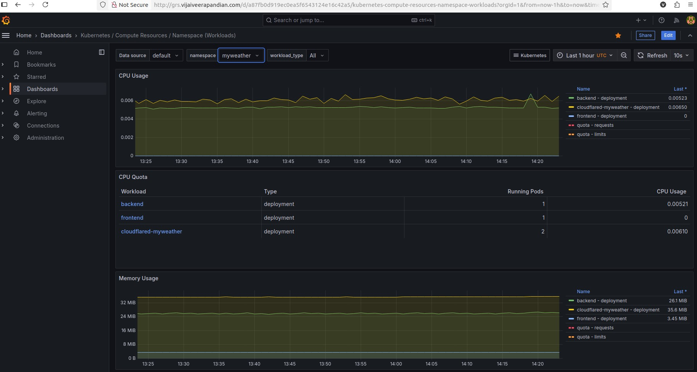

# MyWeather

Personal skill Project, It's a fully automated, cloud-native microservices platform for real-time weather insights, powered by AI and running on a local, multi-node Kubernetes homelab.

Access the live app: [myweather.vijaiveerapandian.com](https://myweather.vijaiveerapandian.com/)
GitHub repository: [github.com/vijai-veerapandian/myweather](https://github.com/vijai-veerapandian/myweather.git)

## Table of Contents

- [Overview](#overview)
- [MyWeather Search Screenshot](#myweather-search-screenshot)
- [Architecture Overview](#architecture-overview)
- [Detailed Architecture](#detailed-architecture)
- [Grafana Monitoring Screenshot](#grafana-monitoring-screenshot)
- [Technical Stack](#technical-stack)
- [Getting Started](#getting-started)
- [Contributing](#contributing)

## Overview

MyWeather started as a simple React JS weather app inspired by FreeCodeCamp and has evolved into a robust, cloud-native and will be Multi-cloud platform soon. It fetches real-time weather data using the OpenWeather API and provides AI-powered weather summaries for enhanced user experience.

Technical stack used:

* Multi-node Kubernetes cluster v1.30.14
* Flux CD for continuous deployment from GitHub repo.
* Persistent storage: Long-horn stores API secret files
* Secrets Management: Hashicorp Vault and External Secrets Operator (ESO) automate secure secret delivery to applications.
* Observability: Prometheus, Grafana, Alertmanager provides monitoring and alerts.
* Edge Security and DNS: Cloudflare for DNS management and DDoS protection for public endpoints.

## MyWeather Search

## Architecture Highlevel simple

High level overview of the architecture.

## Detailed Architecture

Diagram or description of all components, their interactions, and how data flows through the system.

- Frontend (React JS)
- Backend microservices
- AI-powered summarizer
- Kubernetes orchestration
- Persistent storage
- Monitoring stack
- Secret management workflow

## Grafana Monitoring

## Technical Stack

- **Kubernetes (v1.30.14)**: Multi-node cluster for container orchestration
- **Flux CD**: Continuous deployment from GitHub repository
- **Longhorn**: Persistent storage for API secret files
- **HashiCorp Vault \& External Secrets Operator (ESO)**: Automated, secure secrets delivery
- **Prometheus, Grafana, Alertmanager**: Observability, monitoring, and alerting
- **Cloudflare**: DNS management and DDoS protection for public endpoints
- **OpenWeather API**: Real-time weather data
- **AI Summarizer**: Enhanced weather summaries for improved user experience
- **React JS**: Frontend application

## Getting Started

1. **Clone the repository**
`git clone https://github.com/vijai-veerapandian/myweather.git`
2. **Follow the setup instructions** in the [project documentation](https://github.com/vijai-veerapandian/myweather#readme) to deploy on your Kubernetes cluster.
3. **Configure secrets** using HashiCorp Vault and ESO as described in the `docs/` folder.
4. **Monitor and manage** the platform via Prometheus and Grafana dashboards.

## Contributing

Contributions are welcome! Please open issues or submit pull requests via [GitHub](https://github.com/vijai-veerapandian/myweather).
